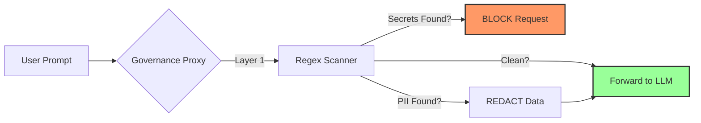

# 🛡️ Enterprise AI Governance Framework

### Layer 7 Security & Guardrails for Generative AI

[]()
[](https://www.python.org/downloads/)
[]()
[]()

---

### 📖 Overview
As enterprises adopt Generative AI, they face the risk of **Data Leakage** (sending PII/Secrets to OpenAI) and **Shadow AI** (using unapproved models).

This framework acts as a **"Governance Proxy"**—a middleware layer that sits between your users and the LLM APIs. It inspects every prompt in real-time to sanitize sensitive data before it leaves your network.

### ⚡ Feature Highlights
* **Multi-Domain Scanning:** Detects PII, Medical Data (HIPAA), and DevOps Secrets (AWS Keys).
* **Policy-as-Code:** Rules (Block vs. Redact) are defined in a simple YAML file (`generative_ai_aup.yaml`), allowing non-technical GRC teams to update policy.
* **Smart Remediation:**
    * **BLOCK:** Stops the request entirely if Secrets or Critical PII (SSN) are found.
    * **REDACT:** Automatically masks lower-risk data (Emails, IPs) and forwards the safe prompt.
* **Rich Reporting:** Provides instant CLI feedback to developers on *why* their prompt was modified.

---

### 🛠️ Quick Start

#### 1. Clone the Repository
```bash
git clone [https://github.com/codyjkeller/ai-governance-framework.git](https://github.com/codyjkeller/ai-governance-framework.git)
cd ai-governance-framework
pip install -r requirements.txt
```

#### 2. Configure Your Policy
Edit `policies/generative_ai_aup.yaml` to define what is blocked vs. redacted:
```yaml
aws_access_key:
  sensitivity: "CRITICAL"
  action: "BLOCK"

email:
  sensitivity: "MEDIUM"
  action: "REDACT"
```

#### 3. Run the Guardrail
Simulate a user prompt passing through the proxy:
```bash
python governance_guardrail.py
```

---

### 🧠 Architecture Logic



---

### 📂 File Structure

```text
.
├── governance_guardrail.py       # The Proxy Logic (Regex Engine + Remediation)
├── policies/
│   └── generative_ai_aup.yaml    # Policy Definition (Rules & Thresholds)
├── requirements.txt              # Dependencies (Rich, PyYAML)
└── README.md                     # Documentation
```
