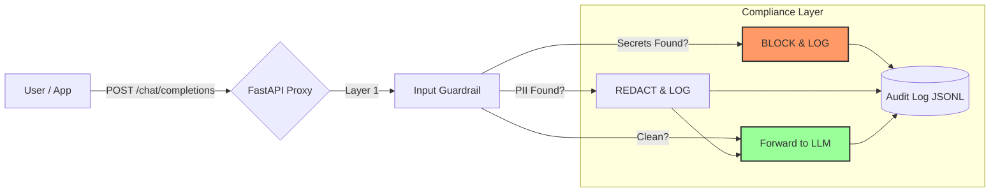

# 🛡️ Enterprise AI Governance Framework

### Layer 7 Security & Guardrails for Generative AI

[]()
[](https://www.python.org/downloads/)
[]()
[]()

---

### 📖 Overview
As enterprises adopt Generative AI, they face the risk of **Data Leakage** (sending PII/Secrets to OpenAI) and **Shadow AI** (using unapproved models).

This framework acts as a **"Governance Proxy"**—a middleware layer (FastAPI) that sits between your users and the LLM APIs. It inspects every prompt in real-time to sanitize sensitive data before it leaves your network, while maintaining an immutable audit trail for GRC compliance.

### ⚡ Feature Highlights
* **Multi-Domain Scanning:** Detects PII, Medical Data (HIPAA), and DevOps Secrets (AWS Keys).
* **Real-Time API Proxy:** A drop-in replacement for OpenAI's API (`/v1/chat/completions`) that enforces policy on every request.
* **Immutable Audit Logging:** Records every Block, Redaction, and Allow decision to JSONL logs for compliance reviews.
* **Policy-as-Code:** Rules are defined in a simple YAML file (`generative_ai_aup.yaml`), allowing non-technical GRC teams to update policy.
* **Smart Remediation:**
    * **BLOCK:** Stops the request entirely if Secrets or Critical PII (SSN) are found.
    * **REDACT:** Automatically masks lower-risk data (Emails, IPs) and forwards the safe prompt.

---

### 🛠️ Quick Start

#### 1. Clone & Install
```bash
git clone [https://github.com/codyjkeller/ai-governance-framework.git](https://github.com/codyjkeller/ai-governance-framework.git)
cd ai-governance-framework
pip install -r requirements.txt
```

#### 2. Configure Your Policy
Edit `policies/generative_ai_aup.yaml` to define what is blocked vs. redacted:
```yaml
aws_access_key:
  sensitivity: "CRITICAL"
  action: "BLOCK"

email:
  sensitivity: "MEDIUM"
  action: "REDACT"
```

#### 3. Run the Governance Server (Production Mode)
Start the FastAPI proxy to govern real-time traffic:
```bash
python server.py
# Server running at [http://0.0.0.0:8000](http://0.0.0.0:8000)
```

#### 4. Run the CLI Demo (Testing Mode)
Visually test your policy rules without starting the server:
```bash
python cli_demo.py
```

#### 5. View Audit Logs
Check the compliance logs to see blocked/redacted transactions:
```bash
cat audit_logs/governance_events.jsonl
```

---

### 🧠 Architecture Logic



---

### 📂 File Structure

```text
.
├── server.py                   # Main FastAPI Application (Production Entrypoint)
├── cli_demo.py                 # Visual CLI Tool for testing policies
├── audit_logger.py             # Immutable Logging Module
├── guardrails/
│   ├── governance_guardrail.py # Layer 1: Input Regex Engine
│   └── output_scanner.py       # Layer 5: Output DLP Scanner
├── policies/
│   └── generative_ai_aup.yaml  # Policy Rules
├── audit_logs/                 # Generated Compliance Logs
├── requirements.txt            # Dependencies (FastAPI, Uvicorn, Rich)
└── README.md                   # Documentation
```
