# 🛡️ Enterprise AI Governance Framework (5-Layer Model)


**A modular "Policy-as-Code" framework designed to allow regulated enterprises (CJIS, HIPAA, SOC 2) to adopt Generative AI while enforcing strict data controls.**

This repository implements a **Governance Proxy** that sits between users and LLMs (like OpenAI or Anthropic). It intercepts traffic to sanitize inputs (Layer 1) and validate outputs (Layer 5) based on a central YAML policy.

## 🏗️ The 5-Layer Architecture
This framework enforces security at every stage of the lifecycle:

1.  **Input Layer:** Sanitization of prompts to prevent PII leakage and Jailbreak attempts.
2.  **Boundary Layer:** Context window management and token budgeting.
3.  **Process Layer (RAG):** Strictly scoped retrieval from verified "Master Answer Banks."
4.  **Quality Layer:** Confidence scoring and citation verification.
5.  **Safety Layer:** Final output scanning for bias, toxicity, or training data leakage.

## 📂 Repository Contents

| Component | File | Description |
| :--- | :--- | :--- |
| **Orchestrator** | [`main.py`](main.py) | **Start Here.** A CLI simulation that runs the full governance pipeline (Input -> Mock LLM -> Output). |
| **Policy Engine** | [`policies/generative_ai_aup.yaml`](policies/generative_ai_aup.yaml) | **The Brain.** YAML definition of acceptable use, including PII rules and wildcard model allow-lists (e.g., `gpt-4*`). |
| **Input Guard** | [`guardrails/pii_scanner.py`](guardrails/pii_scanner.py) | **Layer 1:** Scans and redacts PII (SSN, Email, API Keys) using regex and heuristics *before* the LLM sees it. |
| **Output Guard** | [`guardrails/output_scanner.py`](guardrails/output_scanner.py) | **Layer 5:** Scans LLM responses for data leakage (secrets), hallucinated URLs, or toxic content. |

## 🧪 Demo Walkthrough

This repository includes a simulation (`main.py`) to demonstrate the governance logic in real-time.

### Step 1: Installation
```bash
pip install -r requirements.txt
```

### Step 2: Run "Happy Path" (Redaction Demo)
By default, the simulation sends a prompt containing an **Email Address**. The proxy will detect it, redact it, and allow the safe version to proceed.

```bash
python main.py
```
**Expected Output:**
> ⚠️ PAYLOAD MODIFIED: Sensitive data redacted.
> `[EMAIL_REDACTED]`

### Step 3: Run "Data Leak" (Blocking Demo)
To test Layer 5 (Output Safety), open `main.py` and comment/uncomment the scenarios at the bottom:

```python
# main.py (bottom of file)

# run_governance_pipeline(safe_prompt)        # <--- Comment this out
run_governance_pipeline(leak_prompt)          # <--- Uncomment this
```

Run the script again:
```bash
python main.py
```
**Expected Output:**
> ⛔ OUTPUT BLOCKED: Response Blocked by Output Policy (Data Leakage Detected).

## ⚙️ Logic Flow

```mermaid
graph TD
    User[User / App] -->|Raw Prompt| API[API Gateway]
    
    subgraph "Governance Proxy (The Shield)"
        API -->|Layer 1| PII{PII Scanner}
        PII --"Contains SSN"--> Block[⛔ Block Request]
        PII --"Contains Email"--> Redact[✂️ Redact Data]
        PII --"Clean"--> LLM[External LLM]
    end
    
    LLM -->|Raw Response| Safety{Output Scanner}
    Safety --"Data Leak Detected"--> BlockOutput[⛔ Block Response]
    Safety --"Safe"--> User
    
    style PII fill:#f96,stroke:#333
    style Block fill:#f00,stroke:#333,color:#fff
```



## 🛡️ Supported Detections
* **PII:** SSN, Email, Credit Cards, US Phone Numbers, Street Addresses, IP Addresses.
* **Secrets:** API Keys (AWS, OpenAI, Generic tokens).
* **Hallucinations:** Suspicious/Fake URLs in output.
* **Model Enforcement:** Wildcard support (e.g., allow `claude-3*` but block `evil-gpt-v1`).

---
*Maintained by [Cody Keller](https://github.com/codyjkeller)*
